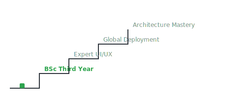

# Hi, I'm C. B. WEERASINGHE

### The Vertical Ascent: Climbing the Repository Stairs
This section details the milestones a developer actively progresses through, step-by-step. Each commitment and completed project represents another flight conquered on the staircase of technical proficiency and professional growth.

  

* [ ] Mastering Enterprise Software Architecture
* [ ] Scaling High-Performance Web Systems
* [ ] Full-Stack Product Engineering Excellence
* [x] Third Year BSc (Hons) Computer Science in Progress

---

### Tech Stack Grid

  

### Developer Metrics

  
  

---

"Committed to building exceptional and efficient digital experiences."

